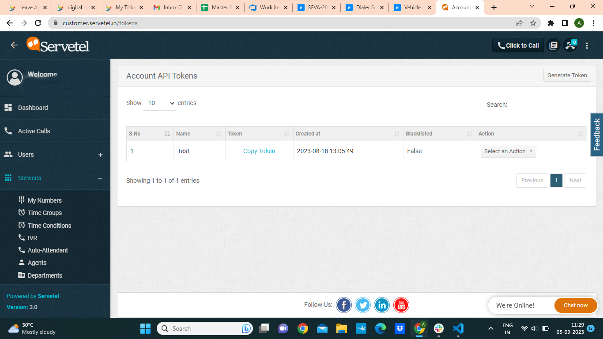
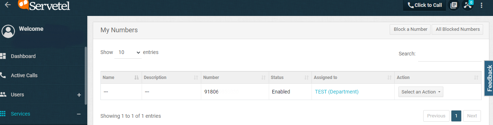
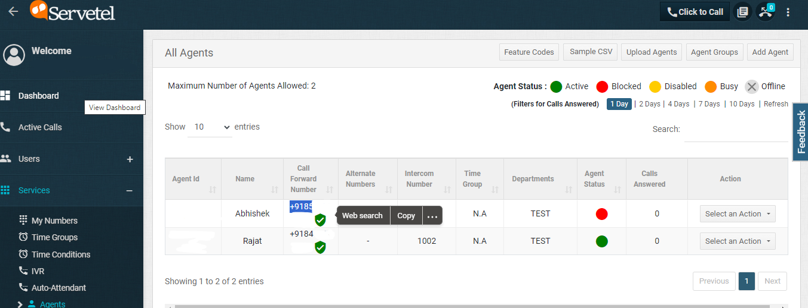
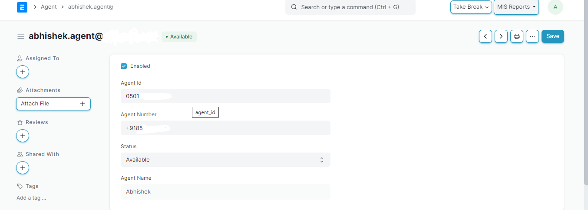
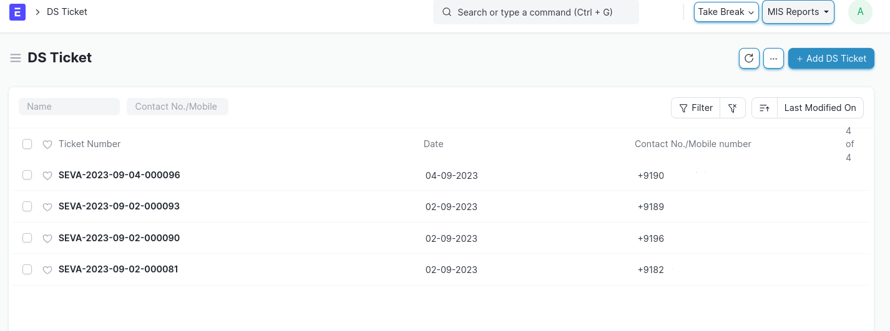
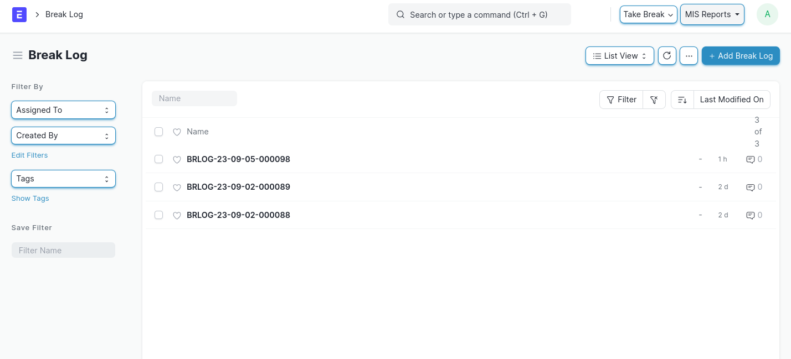
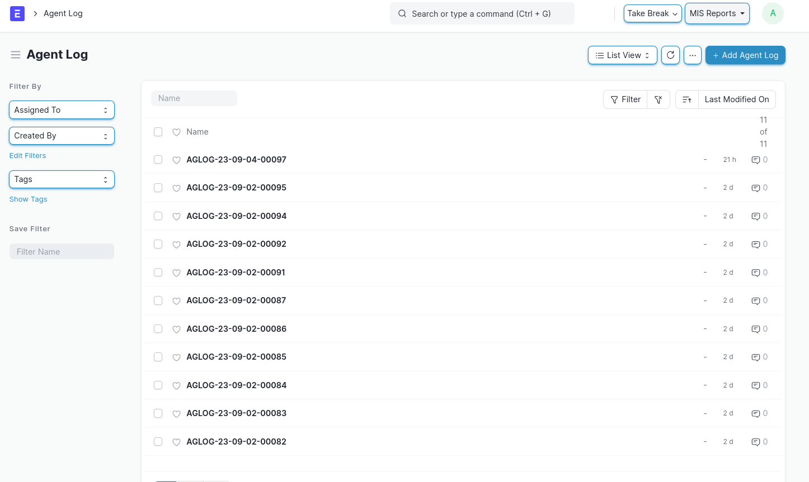
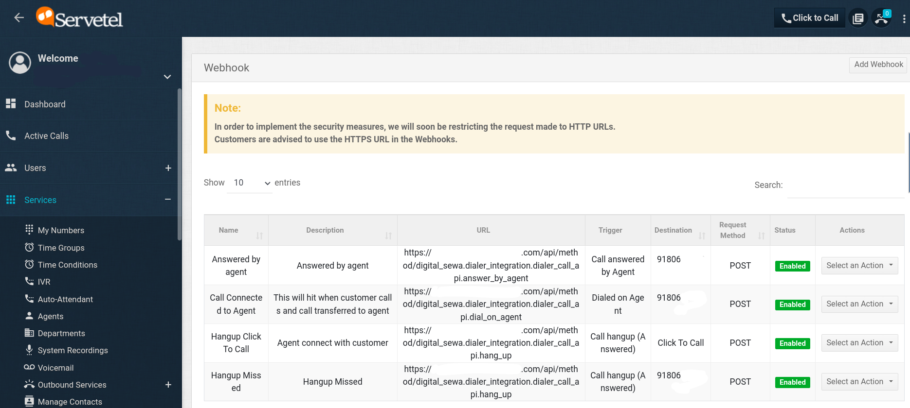

## DigiSewa
An app for Dialer support
## Features

- Ticket creation on **incoming call**
- Filtering tickets aginst
- Agent creation and different status like On Call, On Break
- Click to call from tickets itself
- Log generation for every call


## Installation

Get the app

```bash
bench get-app digital_sewa {github_url} --branch main
```

Install the digital_sewa app

```bash
  bench --site{site_name} Install-app digital_sewa
```

## Configuration


Go To Servetel




Copy the token from here and paste it in dialer settings Authorizatiion

.png)

Copy the Number from my Number section



and paste it in caler id

.png)


Now You can create agents in Servetel



And with same data you also need to create agent in erp side



Now you are good to go when someone call on caller id new DS ticket will be created if exists or else
it will create new DS ticket



## Logs

Break Logs



Agent Logs



Webhook Configuration


